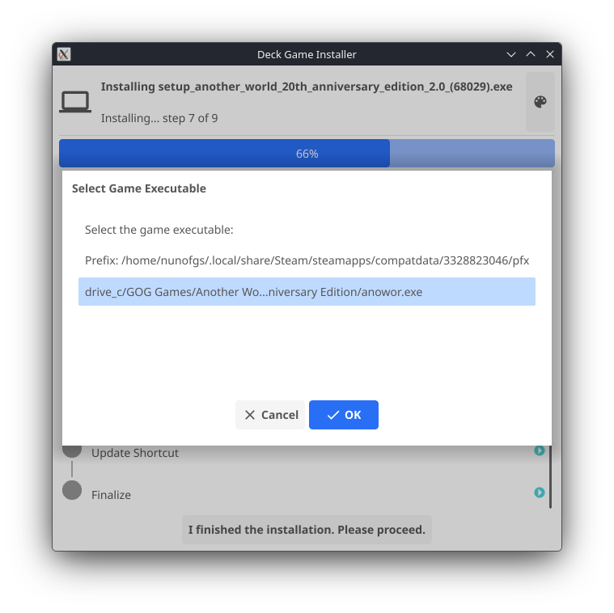

# deck-game-installer

Installing a Windows game on Steam Deck manually means juggling shortcuts, Proton settings, ISO mounts, and installer paths — every single time. It's tedious and it shouldn't be this hard. 😩

**Right-click → Install with Steam → Play.**

---

## Installation

**Option 1 — one-liner:**

```bash
curl -fsSL https://raw.githubusercontent.com/nunofgs/deck-game-installer/main/install.sh | sh
```

**Option 2 — download the zip:**

1. Download `deck-game-installer.zip` from the [latest release](https://github.com/nunofgs/deck-game-installer/releases/latest)
2. Extract it and run:

```bash
unzip deck-game-installer.zip -d deck-game-installer
cd deck-game-installer
./install.sh
```

**To uninstall:**

```bash
curl -fsSL https://raw.githubusercontent.com/nunofgs/deck-game-installer/main/install.sh | sh -s -- --uninstall
```

## Usage

### In Desktop

Right-click any ISO or EXE in Dolphin and choose **Install with Steam**.


#### More screenshots

<details>
<summary>Installation wizard</summary>


</details>

<details>
<summary>Choosing the game executable</summary>



</details>

### From the terminal

```bash
deck-game-installer /path/to/game.iso
deck-game-installer /path/to/setup.exe
deck-game-installer smb://mynas/games/game.iso
```

SMB paths are useful for installing directly from a NAS without copying files to the Deck first.

## How it works

1. Mounts the ISO (or SMB share)
2. Finds and launches the installer through Steam/Proton
3. Watches Steam's logs to detect when the installer exits
4. Scans the Proton prefix for the installed game executable
5. Updates the Steam shortcut to point at the game

## License

MIT
