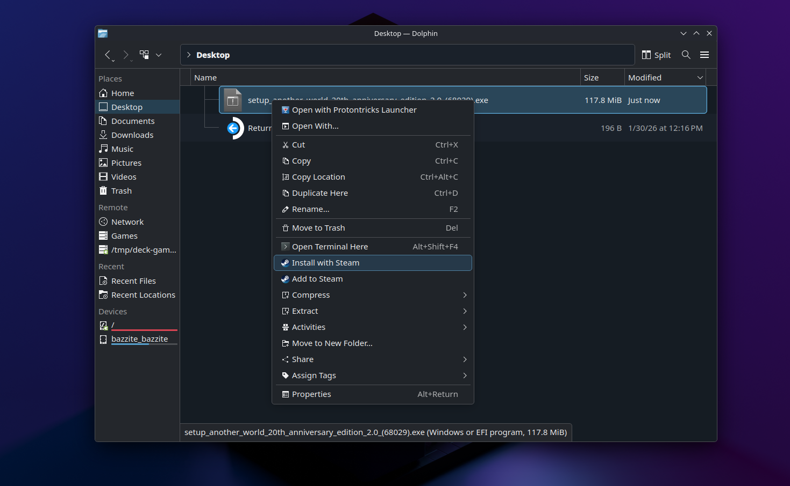
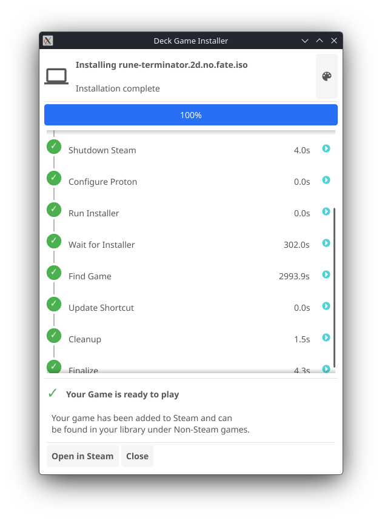

# deck-game-installer

😩 Add a non-Steam shortcut. Set compatibility to Proton. Boot into Desktop Mode. Mount the ISO. Run the installer. Hunt down where it installed to. Go back and fix the shortcut path. If you've installed more than one game on Steam Deck the manual way, you know exactly how tedious this gets.

This tool cuts all of that down to a right-click. Point it at an ISO or EXE — local, or straight from a network share — and it handles mounting, Proton setup, running the installer, finding the game, and updating the shortcut automatically.

**Right-click → Install with Steam → Play.**

---

## Installation

```bash
curl -fsSL https://github.com/nunofgs/deck-game-installer/releases/latest/download/install.sh | sh
```

## Usage

### In Desktop

Right-click any ISO or EXE in Dolphin and choose **Install with Steam**.



The installer runs in a guided window that tracks each step and prompts you when input is needed.



### From the terminal

```bash
deck-game-installer /path/to/game.iso
deck-game-installer /path/to/setup.exe
deck-game-installer smb://mynas/games/game.iso
```

SMB paths are useful for installing directly from a NAS without copying files to the Deck first.

## How it works

1. Mounts the ISO (or SMB share)
2. Finds and launches the installer through Steam/Proton
3. Watches Steam's logs to detect when the installer exits
4. Scans the Proton prefix for the installed game executable
5. Updates the Steam shortcut to point at the game

## License

MIT
